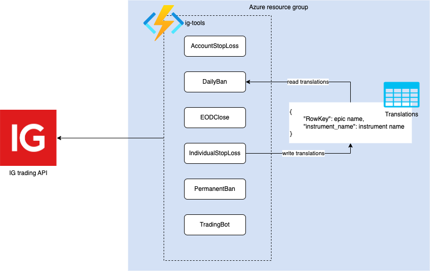

# ig-tools
This project implements some hard rules to minimise losses on the IG trading platform.
These rules put in place some non-negotiable limits that prevent large losses sometime incurred by placing emotional trades.
We have usesd Azure functions, ran at scheduled intervals, to interact with the [IG Trading API](https://labs.ig.com/rest-trading-api-guide).

## Architecture
All endpoints except TradingBot are trigger by a CRON schedule. They interact with the IG trading REST API endpoints.

## How to deploy  
The Azure functions are currently deployed using the VSCode `Deploy to function app...` task.
All required environment variables can be found in `config.py`.

## Learnings  
This project was created a couple of years ago, and there are (quite a) few things I would change if I was to rebuild this. Here are some of the things I think would make the most difference.

### Testing, of course
Knowing what I know now, testing would not be so difficult to set up. I would write all trading logic in a separate module, and thoroughly test this with unit and integration tests, mocking the API calls where necessary.

### Pipelines
CI/CD was not implemented and VSCode's deploy task was used instead. This made it difficult to know which version of the functions was currently live, and also meant it was more difficult for us both to confidently contribute to the project.

### Caching
The functions are not very efficient. For example, functions running at the same time make simultaneous calls to get all open positions on the account. Issues such as this one could be overcome by implementing a cache.
